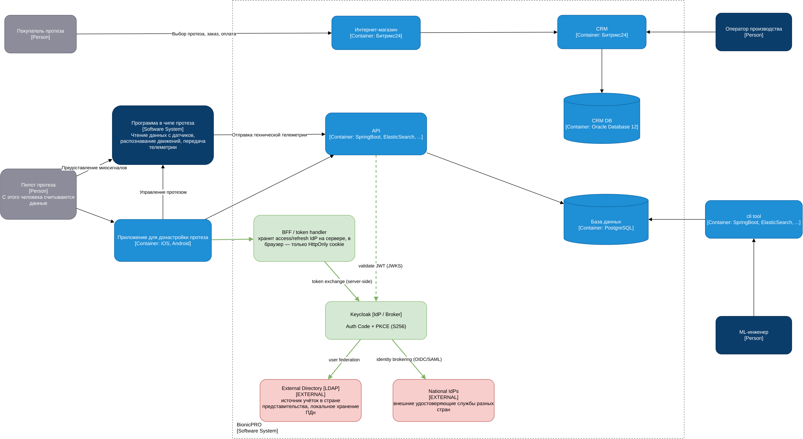

# BionicPRO — Проектная работа 9 спринта

Решение двух заданий: усиление безопасности SSO (Authorization Code + PKCE, схема с BFF и внешними источниками учёток) и сервис отчётов (ETL на Airflow → витрина в ClickHouse → API `/reports` с доступом «только к своим данным»).

## Структура репозитория

| Каталог | Назначение |
|---|---|
| `frontend/` | React-приложение (SSO через Keycloak с PKCE, кнопка «Download Report») |
| `keycloak/` | Realm Keycloak: клиент с PKCE, роли, пользователи |
| `ldap/` | Заготовка внешнего каталога учёток |
| `reports-service/` | FastAPI-сервис `/reports`: отдаёт готовый отчёт из ClickHouse |
| `airflow/` | ETL-DAG: выгрузка из CRM/DB в OLAP и построение витрины |
| `clickhouse/` | DDL витрины `user_reports` |
| `crm/` | Источник-заглушка: клиенты + телеметрия датчиков (Postgres) |
| `docs/diagrams/` | Диаграммы C4 (`.drawio` + `.png`) |

## Запуск

```bash
docker compose up -d
```

| Сервис | URL |
|---|---|
| Keycloak | http://localhost:8080 (admin/admin) |
| Frontend | http://localhost:3000 |
| Reports API | http://localhost:8000 (`/reports`, `/health`) |
| Airflow | http://localhost:8081 |
| ClickHouse | http://localhost:8123 |

---

## Задание 1. Повышение безопасности



**Архитектура (задача 1.1):**
- **Унификация доступа** — единый вход через `Keycloak`; учётки берутся из внешнего `LDAP`-каталога (User Federation), расположенного в стране представительства, с локальным хранением ПДн.
- **Схема токенов без утечки на фронт** — `BFF / token handler` хранит access/refresh-токены IdP на сервере, в браузер отдаётся только `HttpOnly`-cookie.
- **Разные внешние УЦ по странам** — `National IdPs` через Identity Brokering (OIDC/SAML).

**Код (задача 1.2) — Authorization Code + PKCE:**
- `frontend/src/App.tsx` — `pkceMethod: 'S256'`.
- `keycloak/realm-export.json`, клиент `reports-frontend` — `pkce.code.challenge.method = S256`, отключён `directAccessGrants` (убран небезопасный ROPC).

**Проверка PKCE (при поднятом Keycloak):**
```bash
# ROPC (password grant) должен быть закрыт → unauthorized_client
curl -s -X POST http://localhost:8080/realms/reports-realm/protocol/openid-connect/token \
  -d grant_type=password -d client_id=reports-frontend \
  -d username=prothetic1 -d password=prothetic123

# Авторизация без code_challenge должна отклоняться (PKCE обязателен)
curl -s -o /dev/null -D - \
  "http://localhost:8080/realms/reports-realm/protocol/openid-connect/auth?client_id=reports-frontend&response_type=code&scope=openid&redirect_uri=http://localhost:3000/callback" \
  | grep -i location
```

---

## Задание 2. Сервис отчётов


**Архитектура (задача 2.1):** данные готовятся заранее (ETL), отчёт отдаётся мгновенно из OLAP через существующий API.

**Подготовка данных (задача 2.2) — `airflow/dags/etl_reports_dag.py`:**
- DAG `crm_to_olap_reports`, расписание `@daily`.
- Extract из двух источников (клиенты из CRM, телеметрия с датчиков) → агрегация в разрезе пользователя и периода → load в витрину.
- Витрина `reports.user_reports` (`clickhouse/init.sql`): `ReplacingMergeTree`, `ORDER BY (user_id, period)` — быстрый доступ по пользователю.

**API (задача 2.3) — `reports-service/`:** `GET /reports` читает готовую строку из ClickHouse, без вычислений в рантайме.

**Ограничение доступа (задача 2.4):**
- Валидация JWT по JWKS Keycloak; без токена — `401`.
- Требуется роль `prothetic_user`; иначе — `403`.
- `user_id` берётся из токена (`preferred_username`) — пользователь получает только свой отчёт.
- Запрос периода, ещё не обработанного Airflow, → `404`.

**UI (задача 2.5) — `frontend/src/components/ReportPage.tsx`:** кнопка «Download Report» вызывает `/reports` с Bearer-токеном и скачивает отчёт.
