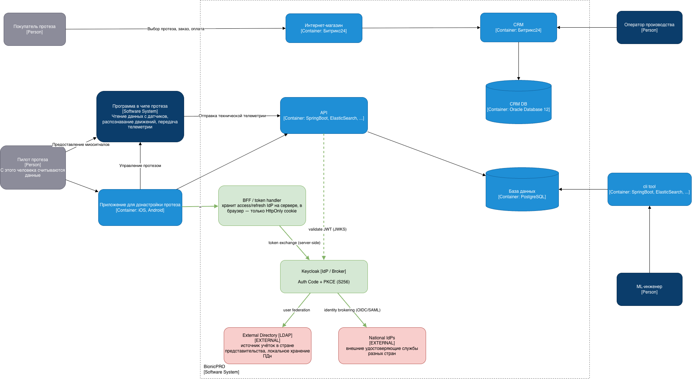
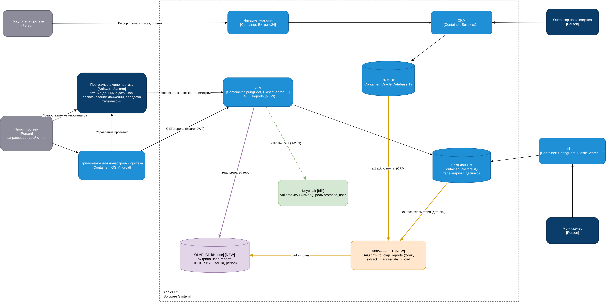

# BionicPRO — Проектная работа 9 спринта

Решение двух заданий: усиление безопасности SSO (Authorization Code + PKCE, схема с BFF и внешними источниками учёток) и сервис отчётов (ETL на Airflow → витрина в ClickHouse → API `/reports` с доступом «только к своим данным»).

## Структура репозитория

| Каталог | Назначение |
|---|---|
| `frontend/` | React-приложение (SSO через Keycloak с PKCE, кнопка «Download Report») |
| `keycloak/` | Realm Keycloak: клиент с PKCE, роли, пользователи |
| `ldap/` | Заготовка внешнего каталога учёток |
| `reports-service/` | FastAPI-сервис `/reports` + `get_token.py` (helper для получения токена по PKCE) |
| `airflow/` | ETL-DAG: выгрузка из CRM/DB в OLAP и построение витрины |
| `clickhouse/` | DDL витрины `user_reports` |
| `crm/` | Источник-заглушка: клиенты + телеметрия датчиков (Postgres) |
| `diagrams/` | Диаграммы C4 (`.drawio` + `.png`) |

## Запуск

```bash
docker compose up -d --build      # или: podman compose up -d --build
docker compose ps                 # дождаться (healthy) у всех сервисов
```

| Сервис | URL / доступ |
|---|---|
| Keycloak | http://localhost:8080 (admin/admin) |
| Frontend | http://localhost:3000 |
| Reports API | http://localhost:8000 (`/reports`, `/health`) |
| Airflow | http://localhost:8081 (admin/admin) |
| ClickHouse | http://localhost:8123 |

Тестовые пользователи Keycloak: `prothetic1..3 / prothetic123` (роль `prothetic_user`), `user1 / password123` (роль `user`), `admin1 / admin123`.

---

## Задание 1. Повышение безопасности



**Архитектура (задача 1.1):**
- **Унификация доступа** — единый вход через `Keycloak`; учётки берутся из внешнего `LDAP`-каталога (User Federation), расположенного в стране представительства, с локальным хранением ПДн.
- **Схема токенов без утечки на фронт** — `BFF / token handler` хранит access/refresh-токены IdP на сервере, в браузер отдаётся только `HttpOnly`-cookie.
- **Разные внешние УЦ по странам** — `National IdPs` через Identity Brokering (OIDC/SAML).

**Код (задача 1.2) — Authorization Code + PKCE:**
- `frontend/src/App.tsx` — `pkceMethod: 'S256'`.
- `keycloak/realm-export.json`, клиент `reports-frontend` — `pkce.code.challenge.method = S256`, отключён `directAccessGrants` (убран небезопасный ROPC).

### Проверка

```bash
# 1. ROPC (password grant) закрыт → {"error":"unauthorized_client", ...}
curl -s -X POST http://localhost:8080/realms/reports-realm/protocol/openid-connect/token \
  -d grant_type=password -d client_id=reports-frontend \
  -d username=prothetic1 -d password=prothetic123

# 2. Авторизация без code_challenge отклоняется (PKCE обязателен)
#    → Location: .../callback?error=invalid_request&error_description=Missing+parameter:+code_challenge_method
curl -s -o /dev/null -D - \
  "http://localhost:8080/realms/reports-realm/protocol/openid-connect/auth?client_id=reports-frontend&response_type=code&scope=openid&redirect_uri=http://localhost:3000/callback" \
  | grep -i location
```

3. **Полный вход:** открыть http://localhost:3000 → «Login» → войти `prothetic1 / prothetic123`. Редирект на Keycloak идёт с `code_challenge` (PKCE), после входа возвращает в приложение.

---

## Задание 2. Сервис отчётов



**Архитектура (задача 2.1):** данные готовятся заранее (ETL), отчёт отдаётся мгновенно из OLAP через существующий API.

**Подготовка данных (задача 2.2) — `airflow/etl_reports_dag.py`:**
- DAG `crm_to_olap_reports`, расписание `@daily`.
- Extract из двух источников (клиенты из CRM, телеметрия с датчиков) → агрегация в разрезе пользователя и периода → load в витрину.
- Витрина `reports.user_reports` (`clickhouse/init.sql`): `ReplacingMergeTree`, `ORDER BY (user_id, period)` — быстрый доступ по пользователю.

**API (задача 2.3) — `reports-service/`:** `GET /reports` читает готовую строку из ClickHouse, без вычислений в рантайме.

**Ограничение доступа (задача 2.4):** валидация JWT по JWKS Keycloak (без токена — `401`), требуется роль `prothetic_user` (иначе `403`), `user_id` берётся из токена — пользователь получает только свой отчёт; период, ещё не обработанный Airflow, → `404`.

**UI (задача 2.5) — `frontend/src/components/ReportPage.tsx`:** кнопка «Download Report» вызывает `/reports` с Bearer-токеном и скачивает отчёт.

### Проверка

```bash
# 1. Запустить ETL (или включить+триггернуть DAG в UI http://localhost:8081)
docker compose exec airflow airflow dags unpause crm_to_olap_reports
docker compose exec airflow airflow dags trigger crm_to_olap_reports

# 2. Витрина наполнилась
curl -s "http://localhost:8123/?query=SELECT%20*%20FROM%20reports.user_reports%20FORMAT%20PrettyCompact"

# 3. Получить токен пользователя (полный PKCE-флоу)
TOKEN=$(python3 reports-service/get_token.py prothetic1 prothetic123)

# 4. Свой отчёт → 200 + JSON
curl -s -H "Authorization: Bearer $TOKEN" http://localhost:8000/reports

# 5. Период из будущего (нет в витрине) → 404
curl -s -o /dev/null -w "%{http_code}\n" -H "Authorization: Bearer $TOKEN" \
  "http://localhost:8000/reports?period=2099-01-01"

# 6. Чужая роль (user1 без prothetic_user) → 403
T2=$(python3 reports-service/get_token.py user1 password123)
curl -s -o /dev/null -w "%{http_code}\n" -H "Authorization: Bearer $T2" http://localhost:8000/reports

# 7. Без токена → 401
curl -s -o /dev/null -w "%{http_code}\n" http://localhost:8000/reports
```

8. **UI end-to-end:** http://localhost:3000 → войти `prothetic1 / prothetic123` → «Download Report» → скачивается файл отчёта.
